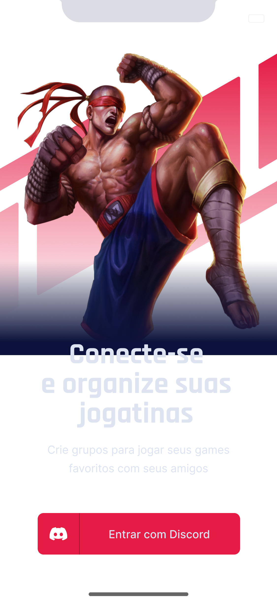
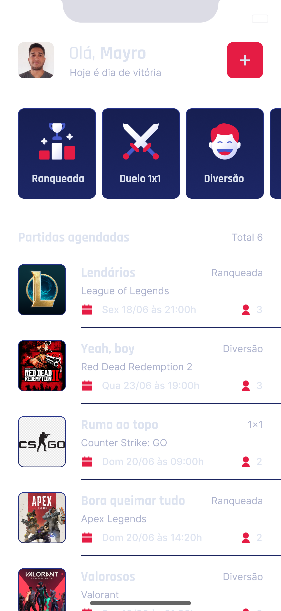
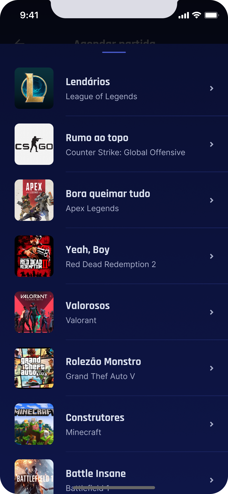

# Gameplay

Aplicativo para lhe ajudar a conectar-se e organiza o momento de diversão e jogar com os amigos. Crie grupos para jogar seus games com seus amigos nesse App que possui autenticação com Discord.

## Layout

Login



Home



Selecionando um servidor



## Features

- [ ] Autenticação Social OAuth2 com servidor do Discord.
- [ ] Obtém perfil do usuário cadastro no Discord (username e avatar);
- [ ] Lista os servidores do Discord que o usuário faz parte;
- [ ] Permite realizar o agendamento de partidas;
- [ ] Permite filtrar as partidas por categoria;
- [ ] Exibe se a partida foi agendada em um servidor próprio (anfitrião) ou em servidores de outros (convidado);
- [ ] Compartilha o convite para ingressar no servidor do usuário;
- [ ] Permite redirecionar o usuário para o seu próprio servidor;
- [ ] Disponibiliza a função de Logout.

## ✨ Tecnologias

- [ ] React Native
- [ ] Typescript
- [ ] Async Storage
- [ ] Axios
- [ ] OAuth2 (Discord)
- [ ] Expo Google Fonts
- [ ] React Navigation Stack
- [ ] Expo Authentication
- [ ] React Native Share
- [ ] Deep Link

## Executando o projeto

Utilize o **yarn** ou o **npm install** para instalar as dependências do projeto.
Em seguida, inicie o projeto.

```cl
expo start
```

Lembre-se de criar o seu App no servidor do Discord para obter as credencias de autenticação. Em seguida, defina no arquivo .env as configurações do seu App (remova o example do arquivo .env.example).

```cl
REDIRECT_URI=
SCOPE=
RESPONSE_TYPE=
CLIENT_ID=
CDN_IMAGE=
```
